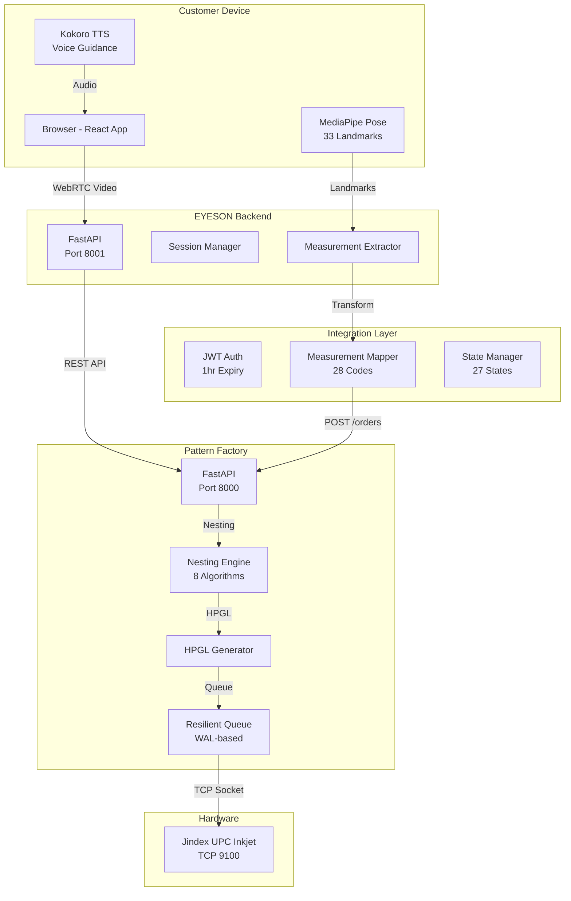

# 01 - System Overview

**Document Version:** 1.0  
**Last Updated:** 2026-02-01  
**Reference:** SUIT_AI_Master_Operations_Manual_v6_7_1.md Section 1.1, 2.1

---

## Table of Contents

1. [Executive Summary](#executive-summary)
2. [High-Level Architecture](#high-level-architecture)
3. [Component Descriptions](#component-descriptions)
4. [Technology Stack](#technology-stack)
5. [Data Flow](#data-flow)
6. [Key Integration Points](#key-integration-points)
7. [Directory Structure](#directory-structure)

---

## Executive Summary

The **PRODUCTION-SCANNER** system is a unified platform combining **EYESON** (browser-based body scanning) with **Pattern Factory** (automated pattern generation) to create a seamless end-to-end bespoke garment manufacturing pipeline.

### Key Metrics

| Metric | Target |
|--------|--------|
| Scan-to-Pattern Time | < 5 minutes |
| Measurement Accuracy | ±0.5-1cm (P0), ±1-2cm (P1) |
| Voice AI Languages | 6 (en, es, fr, de, zh, ar) |
| Cutter Throughput | 60+ patterns/hour |

---

## High-Level Architecture

```
┌─────────────────────────────────────────────────────────────────────────────┐
│                           PRODUCTION-SCANNER SYSTEM                         │
├─────────────────────────────────────────────────────────────────────────────┤
│                                                                             │
│  ┌─────────────────┐         ┌─────────────────┐         ┌───────────────┐ │
│  │   EYESON        │         │   INTEGRATION   │         │   PATTERN     │ │
│  │   SCANNER       │────────▶│   LAYER         │────────▶│   FACTORY     │ │
│  │                 │  HTTPS  │                 │  HTTPS  │               │ │
│  │  • MediaPipe    │         │  • JWT Auth     │         │  • Nesting    │ │
│  │  • Kokoro TTS   │         │  • Transform    │         │  • HPGL Gen   │ │
│  │  • 28 Measures  │         │  • State Mgmt   │         │  • Cutter     │ │
│  └─────────────────┘         └─────────────────┘         └───────────────┘ │
│           │                                                        │       │
│           │                                                        ▼       │
│           │                                               ┌──────────────┐ │
│           │                                               │   JINDEX     │ │
│           │                                               │   CUTTER     │ │
│           │                                               │   TCP:9100   │ │
│           │                                               └──────────────┘ │
│           │                                                                  │
│           ▼                                                                  │
│  ┌─────────────────┐                                                         │
│  │   CUSTOMER      │                                                         │
│  │   BROWSER       │                                                         │
│  │                 │                                                         │
│  │  90-Second Scan │                                                         │
│  └─────────────────┘                                                         │
│                                                                             │
└─────────────────────────────────────────────────────────────────────────────┘
```

### Mermaid Diagram



---

## Component Descriptions

### 1. EYESON Scanner

**Purpose:** Browser-based body scanning with voice-guided instructions

**Key Features:**
- **MediaPipe Pose Detection:** 33 body landmarks at 30 FPS
- **Kokoro-82M TTS:** Open-source text-to-speech (Apache 2.0)
- **90-Second Experience:** Guided scan flow with real-time feedback
- **Offline Capable:** Can queue scans for later processing

**Location:** `eyeson/frontend/` + `eyeson/backend/`

### 2. Pattern Factory

**Purpose:** Automated pattern generation, nesting, and cutter output

**Key Features:**
- **8 Nesting Algorithms:** From shelf-length to genetic optimization
- **HPGL Generation:** Direct cutter output for Jindex UPC Inkjet
- **Resilient Queue:** Write-ahead logging for crash recovery
- **27-State Machine:** Complete order lifecycle tracking

**Location:** `pattern-factory/`

### 3. Integration Layer

**Purpose:** Bridge between EYESON measurements and Pattern Factory orders

**Key Features:**
- **JWT Authentication:** Secure API access with 1-hour tokens
- **Measurement Mapping:** 28 EYESON fields → Pattern Factory codes
- **State Management:** Poll-based status tracking
- **Error Handling:** Automatic retries and fallbacks

**Key Files:**
- `eyeson/frontend/src/services/patternFactoryApi.ts`
- `eyeson/frontend/src/utils/measurementMapping.ts`

---

## Technology Stack

### Backend

| Component | Technology | Version | License |
|-----------|------------|---------|---------|
| API Framework | FastAPI | 0.109+ | MIT |
| Validation | Pydantic | v2 | MIT |
| Documentation | OpenAPI | 3.0 | - |
| Language | Python | 3.10+ | PSF |

### Frontend

| Component | Technology | Version |
|-----------|------------|---------|
| Framework | React | 18+ |
| Language | TypeScript | 5.0+ |
| Build Tool | Vite | 5.0+ |
| Pose Detection | MediaPipe | 0.10+ |
| State Management | Zustand | 4.5+ |

### TTS (Voice AI)

| Component | Technology | License | Cost Savings |
|-----------|------------|---------|--------------|
| Primary | Kokoro-82M | Apache 2.0 | $14,400/year |
| Fallback | Piper | MIT | Free |
| Languages | 6 (en,es,fr,de,zh,ar) | - | - |

### Database & Infrastructure

| Component | Technology | Status |
|-----------|------------|--------|
| Primary DB | PostgreSQL | Planned |
| Cache | Redis | Planned |
| Object Storage | S3-compatible | Planned |
| Container | Docker | Active |

### Cutter Hardware

| Component | Specification |
|-----------|--------------|
| Model | Jindex UPC Inkjet |
| Protocol | RAW TCP |
| Port | 9100 |
| Fabric Width | 62" (157.48 cm) |
| Speed | 60+ patterns/hour |

---

## Data Flow

### Step-by-Step: Scan to Cutter

```
┌────────┐   ┌────────┐   ┌────────┐   ┌────────┐   ┌────────┐   ┌────────┐
│Customer│──▶│ EYESON │──▶│ Pattern│──▶│Nesting │──▶│  HPGL  │──▶│ Cutter │
│        │   │  Scan  │   │ Factory│   │ Engine │   │ Output │   │ Queue  │
└────────┘   └────────┘   └────────┘   └────────┘   └────────┘   └────────┘
     │            │             │            │            │            │
     │            │             │            │            │            │
     ▼            ▼             ▼            ▼            ▼            ▼
  90-Second   28 Measurements  S03 State   8 Algorithms  PLT File   TCP:9100
  Video Scan  {Cg, Wg, Hg...}  Processing  Optimized     Generated  Cut Fabric
```

### Detailed Flow

| Step | Action | System | Time |
|------|--------|--------|------|
| 1 | Customer opens EYESON in browser | Frontend | 0s |
| 2 | Voice AI guides positioning | TTS | 5s |
| 3 | MediaPipe detects 33 landmarks | Frontend | 10s |
| 4 | Customer rotates for 90s capture | Frontend | 90s |
| 5 | Measurements extracted (28 values) | Backend | +5s |
| 6 | POST /orders to Pattern Factory | Integration | +1s |
| 7 | State: S03 (SCAN_RECEIVED) | Pattern Factory | +0s |
| 8 | State: S04 (PROCESSING) - Black Box | Pattern Factory | +30s |
| 9 | Nesting algorithm runs (8 options) | Pattern Factory | +60s |
| 10 | State: S05 (PATTERN_READY) | Pattern Factory | +0s |
| 11 | HPGL/PLT file generated | Pattern Factory | +5s |
| 12 | Auto-submit to cutter queue | Pattern Factory | +1s |
| 13 | State: S06 (CUTTING) | Pattern Factory | +0s |
| 14 | Jindex cutter receives via TCP | Cutter | +variable |
| 15 | State: S07 (PATTERN_CUT) | Pattern Factory | +0s |

**Total Time:** ~3-5 minutes from scan to cutter queue

---

## Key Integration Points

### 1. JWT Authentication (Ops Manual Section 2.5)

```python
# Token Structure
{
  "sub": "user@example.com",
  "exp": 1706784000,  # 1 hour from issue
  "iat": 1706780400,
  "scope": ["orders:read", "orders:write"]
}
```

**Flow:**
1. EYESON frontend: POST `/auth/login` with credentials
2. Pattern Factory returns: `{access_token, refresh_token, expires_in}`
3. EYESON stores token and uses in Authorization header
4. Auto-refresh 5 minutes before expiry

### 2. 27-State Order Machine (Ops Manual Section 1.2)

**EYESON Triggers:**
- `S02 → S03`: When EYESON POSTs new order
- `S04 → S05`: When EYESON polls and files_available=true

**Polling Pattern:**
```typescript
// Poll every 2 seconds until ready
while (status.state !== 'S05') {
  status = await api.getOrderStatus(orderId);
  await sleep(2000);
}
```

### 3. 28 Measurements (Ops Manual Section 13)

**Primary (P0 - ±1cm tolerance):**
- Cg (Chest Girth), Wg (Waist Girth), Hg (Hip Girth)
- Sh (Shoulder Width), Al (Arm Length), Il (Inseam)
- Nc (Neck Girth), plus 6 more

**Secondary (P1 - ±2cm tolerance):**
- 15 additional measurements for grading

**Transformation:**
```typescript
// eyeson/frontend/src/utils/measurementMapping.ts
const pfMeasurements = transformToPatternFactory(eyesonMeasurements);
// Returns: { Cg: {value: 102.5, unit: 'cm', confidence: 0.95}, ... }
```

---

## Directory Structure

```
PRODUCTION-SCANNER/
├── README.md                          # Master project overview
├── INTEGRATION_ARCHITECTURE.md        # Heavy integration documentation
├── docker-compose.yml                 # Full-stack orchestration
├── .env.example                       # Environment template
│
├── eyeson/                            # EYESON Scanner
│   ├── backend/
│   │   ├── src/
│   │   │   ├── api/                   # 6 API modules (auth, sessions, etc.)
│   │   │   ├── services/              # TTS service (Kokoro)
│   │   │   └── core/                  # Configuration
│   │   ├── requirements.txt
│   │   └── main.py
│   ├── frontend/
│   │   ├── src/
│   │   │   ├── components/            # 7 React screens
│   │   │   ├── services/              # patternFactoryApi.ts
│   │   │   ├── utils/                 # measurementMapping.ts
│   │   │   └── store/                 # Zustand state
│   │   └── package.json
│   └── docs/
│       ├── BUILD_NOTES.md
│       ├── PATTERN_FACTORY_INTEGRATION.md
│       └── ADR-001-Open-Source-TTS.md
│
├── pattern-factory/                   # Pattern Factory v6.4.3
│   ├── src/
│   │   ├── api/                       # web_api.py - FastAPI endpoints
│   │   ├── core/                      # Pipeline, scaler, QC
│   │   ├── nesting/                   # 8 nesting algorithms
│   │   ├── workers/                   # Nesting worker + Jindex cutter
│   │   └── integrations/              # BlackBox bridge
│   ├── docs/
│   │   ├── SYSTEM_ARCHITECTURE.md
│   │   └── SOP_COMPLETE.md
│   ├── tests/
│   ├── docker-compose.yml
│   └── requirements.txt
│
└── docs/                              # This documentation
    ├── 01-SYSTEM-OVERVIEW.md          # ← You are here
    ├── 02-MEASUREMENT-MAPPING.md
    ├── 03-ORDER-STATE-MACHINE.md
    ├── 04-API-REFERENCE.md
    ├── 05-SECURITY-AUTH.md
    └── 06-TROUBLESHOOTING.md
```

---

## Next Steps

1. **Read** [02-MEASUREMENT-MAPPING.md](./02-MEASUREMENT-MAPPING.md) for measurement details
2. **Review** [03-ORDER-STATE-MACHINE.md](./03-ORDER-STATE-MACHINE.md) for state transitions
3. **Reference** [04-API-REFERENCE.md](./04-API-REFERENCE.md) for endpoint details

---

*For questions or issues, refer to [06-TROUBLESHOOTING.md](./06-TROUBLESHOOTING.md)*
